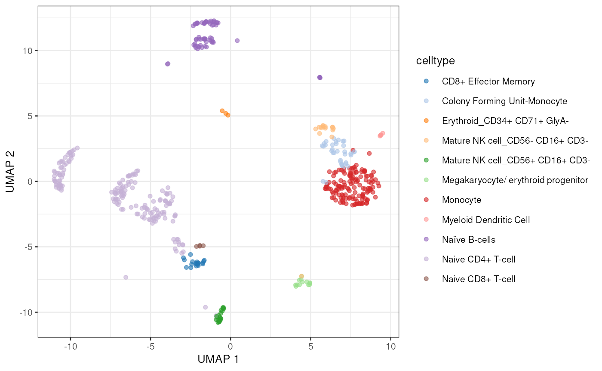
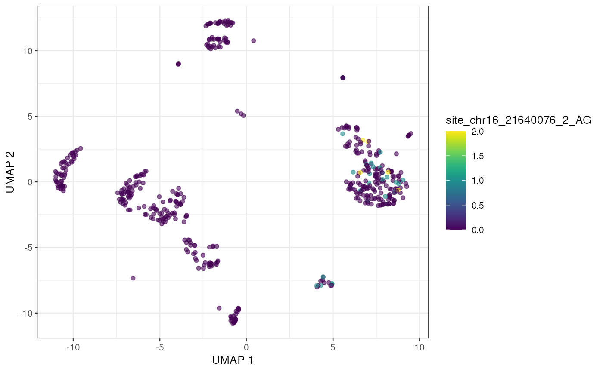
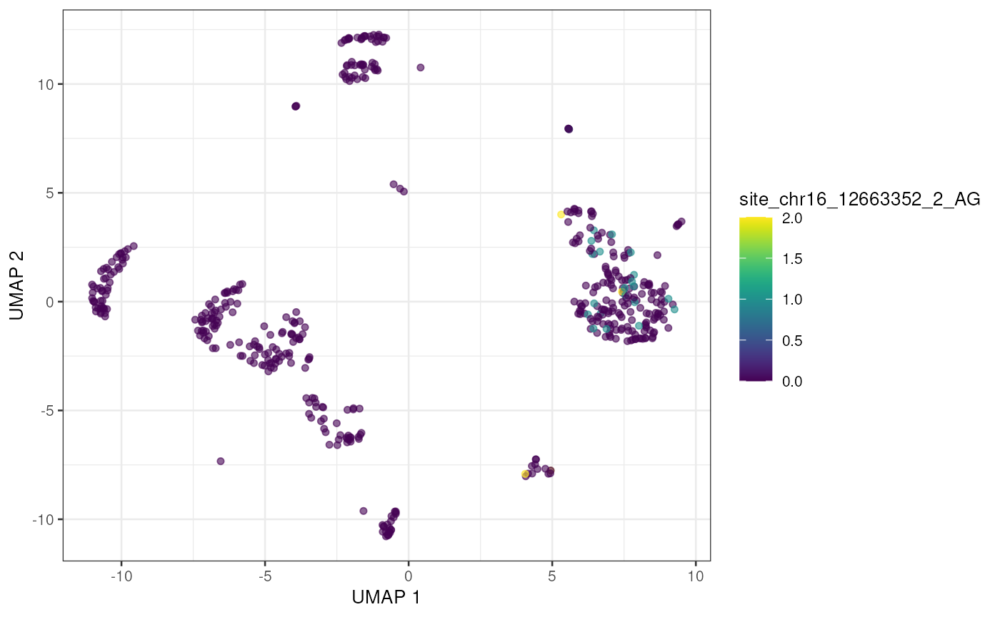
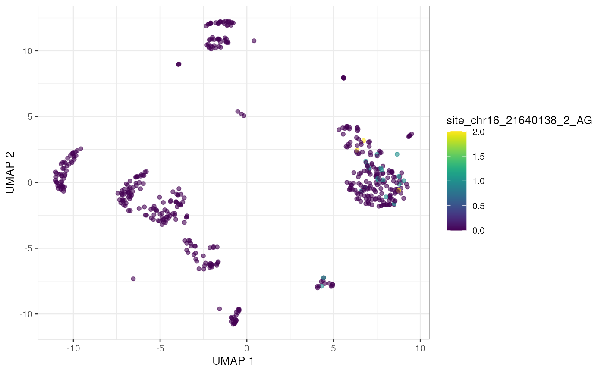
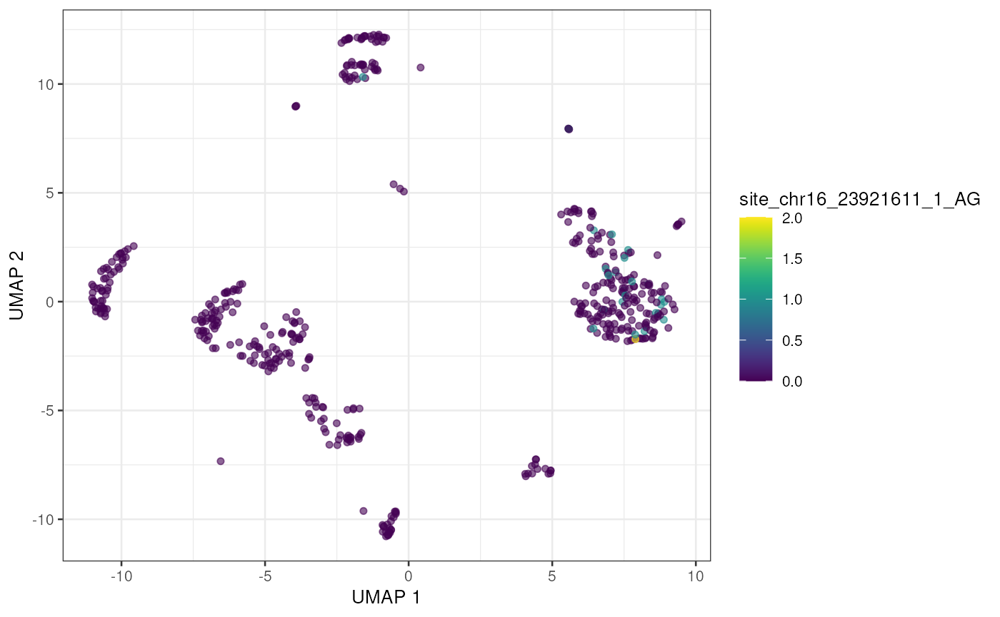
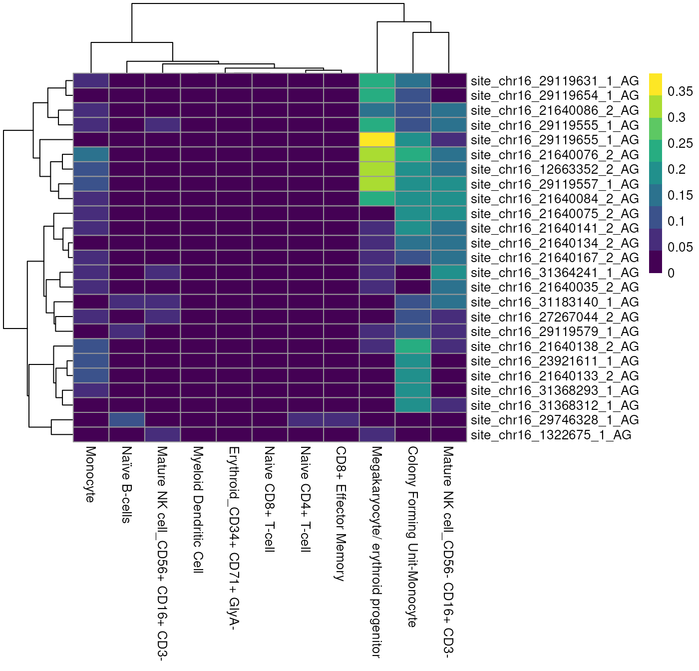
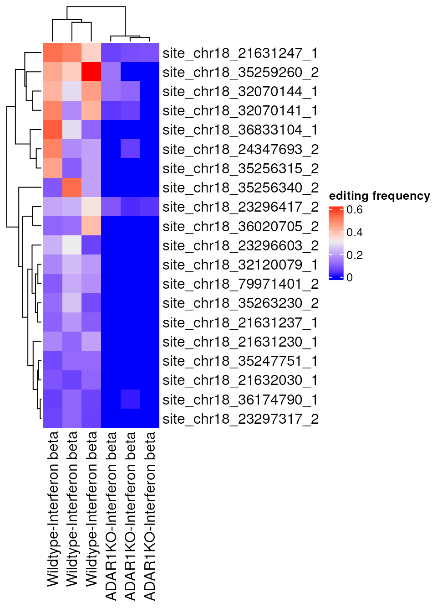
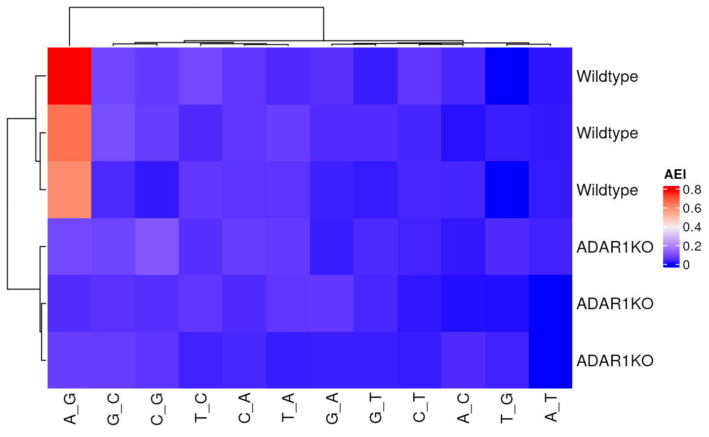

# Introducing the raer package

## Introduction

The *raer* (RNA Adenosine editing in R) package provides tools to
characterize A-to-I editing in single cell and bulk RNA-sequencing
datasets. Both novel and known editing sites can be detected and
quantified beginning with BAM alignment files. At it’s core the *raer*
package uses the pileup routines from the HTSlib C library (Bonfield et
al. (2021)) to identify candidate RNA editing sites, and leverages the
annotation resources in the Bioconductor ecosystem to further
characterize and identify high-confidence RNA editing sites.

Here we demonstrate how to use the *raer* package to a) quantify RNA
editing sites in droplet scRNA-seq dataset, b) identify editing sites
with condition specific editing in bulk RNA-seq data, and c) predict
novel editing sites from bulk RNA-seq.

## Installation

The `raer` package can be installed from Bioconductor using
`BiocManager`.

``` r

if (!require("BiocManager", quietly = TRUE)) {
    install.packages("BiocManager")
}

BiocManager::install("raer")
```

Alternatively `raer` can be installed from github using
`BiocManager::install("rnabioco/raer")`.

## Characterizing RNA editing sites in scRNA-seq data

Here we will use the *raer* package to examine RNA editing in
droplet-based single cell RNA-seq data.
[`pileup_cells()`](https://rnabioco.github.io/raer/reference/pileup_cells.md)
enables quantification of edited and non-edited bases at specified sites
from scRNA-seq data.

For this example we will examine a scRNA-seq dataset from human PBMC
cells provided by [10x
Genomics](https://www.10xgenomics.com/resources/datasets/10k-human-pbmcs-3-v3-1-chromium-x-with-intronic-reads-3-1-high).
The single cell data was aligned and processed using the 10x Genomics
cellranger pipeline.

The PBMC scRNA-seq dataset from 10x Genomics, along with other needed
files will downloaded and cached using
[`pbmc_10x()`](https://rdrr.io/pkg/raerdata/man/pbmc_10x.html)from the
*raerdata* ExperimentHub package. For this vignette, the BAM file was
subset to retain 2 million alignments that overlap human RNA editing
sites on chromosome 16.

[`pbmc_10x()`](https://rdrr.io/pkg/raerdata/man/pbmc_10x.html) returns a
list containing a `BamFile` object, a `GRanges` object with known RNA
editing sites from the `REDIportal` database Mansi et al. (2021), and a
`SingleCellExperiment` populated with the gene expression data and cell
type annotations.

``` r

library(raer)
library(raerdata)

pbmc <- pbmc_10x()

pbmc_bam <- pbmc$bam
editing_sites <- pbmc$sites
sce <- pbmc$sce
```

This dataset contains T-cell, B-cells, and monocyte cell populations.

``` r

library(scater)
library(SingleCellExperiment)
library(GenomeInfoDb)
plotUMAP(sce, colour_by = "celltype")
```



### Specifying sites to quantify

Next we’ll select editing sites to quantify. For this analysis we will
use RNA editing sites cataloged in the REDIportal database Mansi et al.
(2021).

``` r

editing_sites
```

    ## GRanges object with 15638648 ranges and 0 metadata columns:
    ##              seqnames    ranges strand
    ##                 <Rle> <IRanges>  <Rle>
    ##          [1]     chr1     87158      -
    ##          [2]     chr1     87168      -
    ##          [3]     chr1     87171      -
    ##          [4]     chr1     87189      -
    ##          [5]     chr1     87218      -
    ##          ...      ...       ...    ...
    ##   [15638644]     chrY  56885715      +
    ##   [15638645]     chrY  56885716      +
    ##   [15638646]     chrY  56885728      +
    ##   [15638647]     chrY  56885841      +
    ##   [15638648]     chrY  56885850      +
    ##   -------
    ##   seqinfo: 44 sequences from hg38 genome; no seqlengths

The sites to quantify are specified using a custom formatted GRanges
object with 1 base intervals, a strand (+ or -), and supplemented with
metadata columns named `REF` and `ALT` containing the reference and
alternate base to query. In this case we are only interested in A-\>I
editing, so we set the ref and alt to `A` and `G`. Note that the `REF`
and `ALT` bases are in reference to strand. For a `-` strand interval
the bases should be the complement of the `+` strand bases. Also note
that these bases can be stored as traditional character vectors or as
[`Rle()`](https://rdrr.io/pkg/S4Vectors/man/Rle-class.html) objects to
save memory.

``` r

editing_sites$REF <- Rle("A")
editing_sites$ALT <- Rle("G")
editing_sites
```

    ## GRanges object with 15638648 ranges and 2 metadata columns:
    ##              seqnames    ranges strand |   REF   ALT
    ##                 <Rle> <IRanges>  <Rle> | <Rle> <Rle>
    ##          [1]     chr1     87158      - |     A     G
    ##          [2]     chr1     87168      - |     A     G
    ##          [3]     chr1     87171      - |     A     G
    ##          [4]     chr1     87189      - |     A     G
    ##          [5]     chr1     87218      - |     A     G
    ##          ...      ...       ...    ... .   ...   ...
    ##   [15638644]     chrY  56885715      + |     A     G
    ##   [15638645]     chrY  56885716      + |     A     G
    ##   [15638646]     chrY  56885728      + |     A     G
    ##   [15638647]     chrY  56885841      + |     A     G
    ##   [15638648]     chrY  56885850      + |     A     G
    ##   -------
    ##   seqinfo: 44 sequences from hg38 genome; no seqlengths

### Quantifying sites in single cells using *pileup_cells*

[`pileup_cells()`](https://rnabioco.github.io/raer/reference/pileup_cells.md)
quantifies edited and non-edited UMI counts per cell barcode, then
organizes the site counts into a `SingleCellExperiment` object.
[`pileup_cells()`](https://rnabioco.github.io/raer/reference/pileup_cells.md)
accepts a
[`FilterParam()`](https://rnabioco.github.io/raer/reference/pileup_sites.md)
object that specifies parameters for multiple read-level and site-level
filtering and processing options. Note that
[`pileup_cells()`](https://rnabioco.github.io/raer/reference/pileup_cells.md)
is strand sensitive by default, so it is important to ensure that the
strand of the input sites is correctly annotated, and that the
`library-type` is set correctly for the strandedness of the sequencing
library. For 10x Genomics data, the library type is set to
`fr-second-strand`, indicating that the strand of the BAM alignments is
the same strand as the RNA. See [quantifying Smart-seq2 scRNA-seq
libraries](#ss2) for an example of using *pileup_cells()* to handle
unstranded data and data from libraries that produce 1 BAM file for each
cell.

To exclude duplicate reads derived from PCR,
[`pileup_cells()`](https://rnabioco.github.io/raer/reference/pileup_cells.md)
can use a UMI sequence, supplied via the `umi_tag` argument, to only
count 1 read for each CB-UMI pair at each editing site position. Note
however that by default the `bam_flags` argument for the `FilterParam`
class is set to **include** duplicate reads when using
[`pileup_cells()`](https://rnabioco.github.io/raer/reference/pileup_cells.md).
Droplet single cell libraries produce multiple cDNA fragments from a
single reverse transcription event. The cDNA fragments have different
alignment positions due to fragmentation despite being derived from a
single RNA molecule. scRNA-seq data processed by cellranger from 10x
Genomics will set the “Not primary alignment” BAM flag for every read
except one read for each UMI. If duplicates are removed based on this
BAM flag, then only 1 representative fragment for a single UMI will be
examined, which will exclude many valid regions.

To reduce processing time many functions in the *raer* package operate
in parallel across multiple chromosomes. To enable parallel processing,
a `BiocParallel` backend can be supplied via the `BPPARAM` argument
(e.g.  `MultiCoreParam()`).

``` r

outdir <- file.path(tempdir(), "sc_edits")
cbs <- colnames(sce)

params <- FilterParam(
    min_mapq = 255, # required alignment MAPQ score
    library_type = "fr-second-strand", # library type
    min_variant_reads = 1
)

e_sce <- pileup_cells(
    bamfile = pbmc_bam,
    sites = editing_sites,
    cell_barcodes = cbs,
    output_directory = outdir,
    cb_tag = "CB",
    umi_tag = "UB",
    param = params
)
e_sce
```

    ## class: SingleCellExperiment 
    ## dim: 3849 500 
    ## metadata(0):
    ## assays(2): nRef nAlt
    ## rownames(3849): site_chr16_83540_1_AG site_chr16_83621_1_AG ...
    ##   site_chr16_31453268_2_AG site_chr16_31454303_2_AG
    ## rowData names(2): REF ALT
    ## colnames(500): TGTTTGTCAGTTAGGG-1 ATCTCTACAAGCTACT-1 ...
    ##   GGGCGTTTCAGGACGA-1 CTATAGGAGATTGTGA-1
    ## colData names(0):
    ## reducedDimNames(0):
    ## mainExpName: NULL
    ## altExpNames(0):

The outputs from
[`pileup_cells()`](https://rnabioco.github.io/raer/reference/pileup_cells.md)
are a `SingleCellExperiment` object populated with `nRef` and `nAlt`
assays containing the base counts for the reference (unedited) and
alternate (edited) alleles at each position.

The sparseMatrices are also written to files, at a directory specified
by `output_directory`, which can be loaded into R using the
[`read_sparray()`](https://rnabioco.github.io/raer/reference/read_sparray.md)
function.

``` r

dir(outdir)
```

    ## [1] "barcodes.txt.gz" "counts.mtx.gz"   "sites.txt.gz"

``` r

read_sparray(
    file.path(outdir, "counts.mtx.gz"),
    file.path(outdir, "sites.txt.gz"),
    file.path(outdir, "barcodes.txt.gz")
)
```

    ## class: SingleCellExperiment 
    ## dim: 3849 500 
    ## metadata(0):
    ## assays(2): nRef nAlt
    ## rownames(3849): site_chr16_83540_1_AG site_chr16_83621_1_AG ...
    ##   site_chr16_31453268_2_AG site_chr16_31454303_2_AG
    ## rowData names(2): REF ALT
    ## colnames(500): TGTTTGTCAGTTAGGG-1 ATCTCTACAAGCTACT-1 ...
    ##   GGGCGTTTCAGGACGA-1 CTATAGGAGATTGTGA-1
    ## colData names(0):
    ## reducedDimNames(0):
    ## mainExpName: NULL
    ## altExpNames(0):

Next we’ll filter the single cell editing dataset to find sites with an
editing event in at least 5 cells and add the editing counts to the gene
expression SingleCellExperiment as an
[`altExp()`](https://rdrr.io/pkg/SingleCellExperiment/man/altExps.html).

``` r

e_sce <- e_sce[rowSums(assays(e_sce)$nAlt > 0) >= 5, ]
e_sce <- calc_edit_frequency(e_sce,
    edit_from = "Ref",
    edit_to = "Alt",
    replace_na = FALSE
)
altExp(sce) <- e_sce[, colnames(sce)]
```

With the editing sites added to the gene expression SingleCellExperiment
we can use plotting and other methods previously developed for single
cell analysis. Here we’ll visualize editing sites with the highest
edited read counts.

``` r

to_plot <- rownames(altExp(sce))[order(rowSums(assay(altExp(sce), "nAlt")),
    decreasing = TRUE
)]

lapply(to_plot[1:5], function(x) {
    plotUMAP(sce, colour_by = x, by_exprs_values = "nAlt")
})
```

    ## [[1]]



    ## 
    ## [[2]]



    ## 
    ## [[3]]


    ## 
    ## [[4]]



    ## 
    ## [[5]]



Alternatively we can view these top edited sites as a Heatmap, showing
the average number of edited reads per site in each cell type.

``` r

altExp(sce)$celltype <- sce$celltype

plotGroupedHeatmap(altExp(sce),
    features = to_plot[1:25],
    group = "celltype",
    exprs_values = "nAlt"
)
```



*raer* provides additional tools to examine cell type specific editing.

- [`find_scde_sites()`](https://rnabioco.github.io/raer/reference/find_scde_sites.md)
  will perform statistical testing to identify sites with different
  editing frequencies between clusters/cell types.

- [`calc_scAEI()`](https://rnabioco.github.io/raer/reference/calc_scAEI.md)
  will calculate the Alu Editing Index (`AEI`) metric in single cells.

**If the editing sites of interest are not known, we recommend the
following approach. First, treat the single cell data as a bulk RNA-seq
experiment, and follow approaches described in the [Novel editing site
detection](#novel) to identify putative editing sites. Then query these
sites in single cell mode using
[`pileup_cells()`](https://rnabioco.github.io/raer/reference/pileup_cells.md)**

### Quantifying sites in Smart-seq2 libaries

[`pileup_cells()`](https://rnabioco.github.io/raer/reference/pileup_cells.md)
can also process Smart-seq2 single cell libraries. These datasets
typically store data from each cell in separate BAM files and the
library type for these alignments are generally unstranded. To process
these datasets the `library-type` should be set to `unstranded`, and the
reference editing sites need to be reported all on the `+` strand.

For example, the editing sites on the minus strand will need to be
complemented (set as T -\> C rather than A -\> G). Additionally the
`umi_tag` and `cb_tag` arguments should be set as follows to disable UMI
and cell barcode detection.

To illustrate this functionality, we will reprocess the 10x Genomics
pbmc dataset, treating the data as mock Smart-seq2 data from 3 cells.

``` r

is_minus <- strand(editing_sites) == "-"
editing_sites[is_minus]$REF <- "T"
editing_sites[is_minus]$ALT <- "C"
strand(editing_sites[is_minus]) <- "+"

fp <- FilterParam(
    library_type = "unstranded",
    min_mapq = 255,
    min_variant_reads = 1
)

ss2_bams <- c(pbmc_bam, pbmc_bam, pbmc_bam)
cell_ids <- c("cell1", "cell2", "cell3")

pileup_cells(
    bamfiles = ss2_bams,
    cell_barcodes = cell_ids,
    sites = editing_sites,
    umi_tag = NULL, # no UMI tag in most Smart-seq2 libraries
    cb_tag = NULL, # no cell barcode tag
    param = fp,
    output_directory = outdir
)
```

    ## class: SingleCellExperiment 
    ## dim: 53971 3 
    ## metadata(0):
    ## assays(2): nRef nAlt
    ## rownames(53971): site_chr16_22107_1_TC site_chr16_22140_1_TC ...
    ##   site_chr16_31454310_1_TC site_chr16_31454314_1_TC
    ## rowData names(2): REF ALT
    ## colnames(3): cell1 cell2 cell3
    ## colData names(0):
    ## reducedDimNames(0):
    ## mainExpName: NULL
    ## altExpNames(0):

## Quantifying RNA editing sites in bulk RNA-Seq

Next we will perform a reanalysis of a published bulk RNA-seq dataset
using the *raer* package. The
[`pileup_sites()`](https://rnabioco.github.io/raer/reference/pileup_sites.md)
function enable quantification of base counts from bulk RNA-seq data and
can be used to identify novel sites (see [Novel editing site
detection](#novel)).

For this reanalysis, we will examine a bulk RNA-seq dataset from
accession
[GSE99249](https://www.ncbi.nlm.nih.gov/geo/query/acc.cgi?acc=GSE99249),
which consists of RNA-seq data from ADAR1 mutants and control human cell
lines, conditionally treated with Interferon-Beta. We will examine data
from two genotypes, ADAR1 WT and KO, both treated with Interferon-B,
with triplicate samples.

Aligned BAM files and other necessary files have been preprocessed for
this vignette and are available using
[`GSE99249()`](https://rdrr.io/pkg/raerdata/man/GSE99249.html) from the
`raerdata` package. Calling
[`GSE99249()`](https://rdrr.io/pkg/raerdata/man/GSE99249.html) will
downloaded and cache the necessary files and return a list containing
the data.

``` r

ifnb <- GSE99249()
names(ifnb)
```

    ## [1] "bams"  "fasta" "sites"

`bams` contains a vector of `BamFile` objects with the paths to each BAM
file. These BAM files are a subset of the full BAM files, containing
alignments from chromosome 18.

``` r

bam_files <- ifnb$bams
names(bam_files)
```

    ## [1] "SRR5564260" "SRR5564261" "SRR5564269" "SRR5564270" "SRR5564271"
    ## [6] "SRR5564277"

To quantify editing sites we will need a FASTA file to compare read
alignments to the reference sequence. For space reasons we’ll use a
FASTA file containing only chromosome 18 for this demo.

``` r

fafn <- ifnb$fasta
```

We will again use the database of known human editing sites from
REDIPortal, only processing those from `chr18`.

``` r

editing_sites <- ifnb$sites
chr_18_editing_sites <- keepSeqlevels(editing_sites, "chr18",
    pruning.mode = "coarse"
)
```

### Generate editing site read counts using *pileup_sites*

The
[`pileup_sites()`](https://rnabioco.github.io/raer/reference/pileup_sites.md)
function will process BAM files and calculate base counts at each
supplied position. The
[`FilterParam()`](https://rnabioco.github.io/raer/reference/pileup_sites.md)
will again be used to specify parameters to exclude reads and bases
based on commonly used filters for detecting RNA-editing events.
Specific regions can also be queried using the `region` argument which
accepts a samtools style region specification string (e.g. `chr` or
`chr:start-end`).

``` r

fp <- FilterParam(
    only_keep_variants = TRUE, # only report sites with variants
    trim_5p = 5, # bases to remove from 5' or 3' end
    trim_3p = 5,
    min_base_quality = 30, # minimum base quality score
    min_mapq = 255, # minimum MAPQ read score
    library_type = "fr-first-strand", # library type
    min_splice_overhang = 10 # minimum required splice site overhang
)

rse <- pileup_sites(bam_files,
    fasta = fafn,
    sites = chr_18_editing_sites,
    chroms = "chr18",
    param = fp
)

rse
```

    ## class: RangedSummarizedExperiment 
    ## dim: 6192 6 
    ## metadata(0):
    ## assays(7): ALT nRef ... nC nG
    ## rownames(6192): site_chr18_178100_1 site_chr18_184553_1 ...
    ##   site_chr18_80172518_2 site_chr18_80174441_2
    ## rowData names(4): REF rpbz vdb sor
    ## colnames(6): SRR5564260 SRR5564261 ... SRR5564271 SRR5564277
    ## colData names(1): sample

Pileup data is stored in a `RangedSummarizedExperiment` object which
facilitates comparisons across samples and conveniently stores genomic
coordinate information. The
[`rowData()`](https://rdrr.io/pkg/SummarizedExperiment/man/SummarizedExperiment-class.html)
and `rowRanges()` slots are populated with the reference base (`REF`)
and information related to each editing site, and similarly the
[`colData()`](https://rdrr.io/pkg/SummarizedExperiment/man/SummarizedExperiment-class.html)
slot can be used to store sample metadata.

The base counts and other information are stored in different assays
within the object. `REF` and `ALT` bases and base count data are all
provided in a stand specific fashion depending on the supplied
`library-type` parameter. The `REF` and `ALT` bases are in reference to
the strand.

``` r

assays(rse)
```

    ## List of length 7
    ## names(7): ALT nRef nAlt nA nT nC nG

``` r

assay(rse, "nA")[1:5, ]
```

    ##                     SRR5564260 SRR5564261 SRR5564269 SRR5564270 SRR5564271
    ## site_chr18_178100_1          2          0          0          1          1
    ## site_chr18_184553_1          0          1          1          2          3
    ## site_chr18_184659_1          2          0          1          1          2
    ## site_chr18_184747_1          1          4          2          4          3
    ## site_chr18_185203_1          1          0          1          1          1
    ##                     SRR5564277
    ## site_chr18_178100_1          2
    ## site_chr18_184553_1          3
    ## site_chr18_184659_1          1
    ## site_chr18_184747_1          2
    ## site_chr18_185203_1          0

``` r

assay(rse, "nG")[1:5, ]
```

    ##                     SRR5564260 SRR5564261 SRR5564269 SRR5564270 SRR5564271
    ## site_chr18_178100_1          0          0          0          0          1
    ## site_chr18_184553_1          0          0          0          0          1
    ## site_chr18_184659_1          0          0          0          0          1
    ## site_chr18_184747_1          0          0          0          0          0
    ## site_chr18_185203_1          0          0          0          0          0
    ##                     SRR5564277
    ## site_chr18_178100_1          0
    ## site_chr18_184553_1          0
    ## site_chr18_184659_1          0
    ## site_chr18_184747_1          1
    ## site_chr18_185203_1          0

Next we’ll add sample information which will be needed for identify
sites with differential editing frequencies across genotypes.

``` r

colData(rse)$treatment <- "Interferon beta"
colData(rse)$genotype <- factor(rep(c("ADAR1KO", "Wildtype"), each = 3))
colData(rse)
```

    ## DataFrame with 6 rows and 3 columns
    ##                 sample       treatment genotype
    ##            <character>     <character> <factor>
    ## SRR5564260  SRR5564260 Interferon beta ADAR1KO 
    ## SRR5564261  SRR5564261 Interferon beta ADAR1KO 
    ## SRR5564269  SRR5564269 Interferon beta ADAR1KO 
    ## SRR5564270  SRR5564270 Interferon beta Wildtype
    ## SRR5564271  SRR5564271 Interferon beta Wildtype
    ## SRR5564277  SRR5564277 Interferon beta Wildtype

### Prepare for differential editing

*raer* provides the `calc_edit_frequency` function to calculate the
editing percentage and read depth at each position. With the
`drop = TRUE` argument we will also exclude non-adenosine sites. The
editing frequencies will not be used for differential editing analysis,
which will be conducted using the raw counts, however these are useful
for filtering and visualization. `calc_edit_frequency` will add two
additional assays to the object, the editing frequency (`edit_freq`) and
read `depth`, both computed based on the `edit_to` and `edit_from`
counts.

``` r

rse <- calc_edit_frequency(rse,
    edit_from = "A",
    edit_to = "G",
    drop = TRUE
)
```

We’ll next filter to exclude low frequency editing events. For this
analysis we require that an editing site shows editing in at least 1
sample and has at least 5 counts in each sample.

``` r

has_editing <- rowSums(assay(rse, "edit_freq") > 0) >= 1
has_depth <- rowSums(assay(rse, "depth") >= 5) == ncol(rse)

rse <- rse[has_editing & has_depth, ]
rse
```

    ## class: RangedSummarizedExperiment 
    ## dim: 612 6 
    ## metadata(0):
    ## assays(9): ALT nRef ... depth edit_freq
    ## rownames(612): site_chr18_204626_1 site_chr18_212426_1 ...
    ##   site_chr18_79984359_2 site_chr18_79984760_2
    ## rowData names(4): REF rpbz vdb sor
    ## colnames(6): SRR5564260 SRR5564261 ... SRR5564271 SRR5564277
    ## colData names(5): sample treatment genotype n_sites edit_idx

Once the object has been filtered, we will transform it into an
alternative data structure for differential editing analysis that
contains an assay with read counts of both the `ALT` and `REF` alleles
in a single matrix.

``` r

deobj <- make_de_object(rse, min_prop = 0.05, min_samples = 3)

assay(deobj, "counts")[1:3, c(1, 7, 2, 8)]
```

    ##                     SRR5564260_ref SRR5564260_alt SRR5564261_ref SRR5564261_alt
    ## site_chr18_691546_2              8              0              6              0
    ## site_chr18_691578_2              8              0              7              0
    ## site_chr18_692372_2              6              0              9              0

### Run differential editing

At this stage, you can use the object to perform differential yourself
or use
[`find_de_sites()`](https://rnabioco.github.io/raer/reference/find_de_sites.md)
to use `edgeR` or `DESeq2` to identify condition specific editing
events. For differential editing, we use the design
`design <- ~0 + condition:sample + condition:count` and perform testing
to compare the edited read counts against unedited read counts.

``` r

deobj$sample <- factor(deobj$sample)
de_results <- find_de_sites(deobj,
    test = "DESeq2",
    sample_col = "sample",
    condition_col = "genotype",
    condition_control = "Wildtype",
    condition_treatment = "ADAR1KO"
)
```

This returns a list containing the dds object, the full results, the
significant results, and the model matrix.

``` r

de_results$sig_results[1:5, ]
```

    ##                        baseMean log2FoldChange     lfcSE      stat      pvalue
    ## site_chr18_23296417_2 15.500000      -2.450652 0.8459822 -2.896813 0.003769742
    ## site_chr18_32070144_1  6.666667      -2.631946 1.0760283 -2.445983 0.014445798
    ## site_chr18_21632030_1 10.000000      -3.377617 1.4959882 -2.257783 0.023959185
    ## site_chr18_21631237_1  6.666667      -3.381984 1.5541279 -2.176130 0.029545546
    ## site_chr18_35263230_2  9.333333      -3.403508 1.4894626 -2.285057 0.022309459
    ##                              padj
    ## site_chr18_23296417_2 0.008216103
    ## site_chr18_32070144_1 0.024557856
    ## site_chr18_21632030_1 0.036474262
    ## site_chr18_21631237_1 0.044059148
    ## site_chr18_35263230_2 0.035633191

``` r

library(ComplexHeatmap)
top_sites <- rownames(de_results$sig_results)[1:20]

Heatmap(assay(rse, "edit_freq")[top_sites, ],
    name = "editing frequency",
    column_labels = paste0(rse$genotype, "-", rse$treatment)
)
```



As anticipated the top identified sites are those with greatly reduced
editing in the ADAR1KO samples.

### Examine overall editing activites using the Alu Editing Index

For some studies it is informative to assess the overall ADAR editing
activity in addition to examining individual editing sites. The **Alu
Editing Index** (AEI), developed by Roth et al. (2019), is a metric that
summarizes that amount of editing occurring at ALU elements which
account for the vast majority of A-to-I editing (\> 99%) in humans.

*raer* provides
[`calc_AEI()`](https://rnabioco.github.io/raer/reference/calc_AEI.md),
based on this approach, to calculate the AEI metric. Many of the same
parameters used for
[`pileup_sites()`](https://rnabioco.github.io/raer/reference/pileup_sites.md)
are available in
[`calc_AEI()`](https://rnabioco.github.io/raer/reference/calc_AEI.md).

First we will use the `AnnotationHub` package to obtain coordinates for
ALU elements in the human genome. For this example we will only examine
a subset of ALUs on `chr18`. We will also use a `SNPlocs` package, based
on the dbSNP database, to exclude any SNPs overlapping the ALU elements
from the AEI calculation. The SNP coordinates are `NCBI` based, whereas
the `ALU` elements are based on `hg38`, we will therefore convert
between the two as needed to obtain SNP and ALU element coordinates
based on `hg38`.

``` r

library(AnnotationHub)
library(SNPlocs.Hsapiens.dbSNP144.GRCh38)

ah <- AnnotationHub()
rmsk_hg38 <- ah[["AH99003"]]

alus <- rmsk_hg38[rmsk_hg38$repFamily == "Alu", ]
alus <- alus[seqnames(alus) == "chr18", ]
alus <- keepStandardChromosomes(alus)
alus <- alus[1:1000, ]

seqlevelsStyle(alus) <- "NCBI"
genome(alus) <- "GRCh38.p2"

alu_snps <- get_overlapping_snps(alus, SNPlocs.Hsapiens.dbSNP144.GRCh38)

seqlevelsStyle(alu_snps) <- "UCSC"
alu_snps[1:3, ]
```

    ## UnstitchedGPos object with 3 positions and 0 metadata columns:
    ##       seqnames       pos strand
    ##          <Rle> <integer>  <Rle>
    ##   [1]    chr18     21651      *
    ##   [2]    chr18     21654      *
    ##   [3]    chr18     21667      *
    ##   -------
    ##   seqinfo: 25 sequences (1 circular) from hg38 genome

``` r

seqlevelsStyle(alus) <- "UCSC"
alus[1:3, ]
```

    ## GRanges object with 3 ranges and 11 metadata columns:
    ##       seqnames      ranges strand |   swScore  milliDiv  milliDel  milliIns
    ##          <Rle>   <IRanges>  <Rle> | <integer> <numeric> <numeric> <numeric>
    ##   [1]    chr18 21645-21819      + |      1319       114         0         0
    ##   [2]    chr18 26052-26327      + |      1539       199         7         0
    ##   [3]    chr18 31708-32021      + |      2192       140         0         3
    ##        genoLeft     repName    repClass   repFamily  repStart    repEnd
    ##       <integer> <character> <character> <character> <integer> <integer>
    ##   [1] -80351466      AluSq2        SINE         Alu       136       310
    ##   [2] -80346958       AluJr        SINE         Alu         1       278
    ##   [3] -80341264       AluSp        SINE         Alu         1       313
    ##         repLeft
    ##       <integer>
    ##   [1]        -3
    ##   [2]       -34
    ##   [3]         0
    ##   -------
    ##   seqinfo: 25 sequences (1 circular) from hg38 genome

[`calc_AEI()`](https://rnabioco.github.io/raer/reference/calc_AEI.md)
returns a matrix containing the AEI calculated for all allelic
combinations and a more detailed table containing values for each
chromosome.

``` r

alu_index <- calc_AEI(bam_files,
    fasta = fafn,
    snp_db = alu_snps,
    alu_ranges = alus,
    param = fp
)
names(alu_index)
```

    ## [1] "AEI"           "AEI_per_chrom"

``` r

Heatmap(alu_index$AEI,
    name = "AEI",
    row_labels = rse$genotype[match(rownames(alu_index$AEI), rse$sample)]
)
```



The AEI in the `Wildtype` samples is highest for `A-to-G`, and sharply
reduced in the `ADAR1KO` samples as expected.

## Novel RNA editing site detection

Next we will demonstrate how to identify novel RNA editing sites using
the *raer* package. It is best practice to have a matched DNA sequencing
dataset to exclude sample specific genetic variation and common
alignment artifacts. However, high confidence editing sites can also be
identified if the dataset contains many samples and there are high
coverage SNP databases for the organism queried. Additionally high
confidence editing sites can also be identified if a dataset contains a
sample with reduced or absent ADAR activity. A false-positive rate
estimate can be obtained by examining the proportion of A-\>I editing
sites recovered, relative to other variants, (e.g. G-\>C, C-\>A).

In this analysis a published RNA-seq and whole genome sequencing dataset
will be analyzed. High coverage whole-genome sequencing was conducted
[ERR262997](https://www.ebi.ac.uk/ena/browser/view/ERR262997?show=reads)
along with paired-end RNA-seq
[SRR1258218](https://www.ebi.ac.uk/ena/browser/view/SRR1258218?show=reads)
in a human cell line (`NA12878`).

Aligned BAM files, a genome FASTA file, and a GRanges object containing
SNPs corresponding to the first 1Mb region of chr4 have been prepared
for this vignette and can be downloaded and cached using
[`NA12878()`](https://rdrr.io/pkg/raerdata/man/NA12878.html).

``` r

rna_wgs <- NA12878()
names(rna_wgs)
```

    ## [1] "bams"  "fasta" "snps"

Additionally we will use the following additional annotation resources:

- A database of known SNPs, for example from the
  `SNPlocs.Hsapiens.dbSNP144.GRCh38` package. Due to space and memory
  constraints in this vignette we will only examine SNPs from the first
  1Mb region of chr4.

- `TxDb.Hsapiens.UCSC.hg38.knownGene`, a database of transcript models.
  Alternatively these can be generated from a `.gtf` file using
  [`makeTxDbFromGRanges()`](https://rdrr.io/pkg/txdbmaker/man/makeTxDbFromGRanges.html)
  from the `txdbmaker` package.

- RepeatMasker annotations, which can be obtained from the
  [`AnnotationHub()`](https://rdrr.io/pkg/AnnotationHub/man/AnnotationHub-class.html)
  for hg38, as shown in the [bulk RNA-seq](#bulk) tutorial.

``` r

library(TxDb.Hsapiens.UCSC.hg38.knownGene)

txdb <- TxDb.Hsapiens.UCSC.hg38.knownGene
chr4snps <- rna_wgs$snps
```

The
[`pileup_sites()`](https://rnabioco.github.io/raer/reference/pileup_sites.md)
function accept multiple BAM files, here we supply one from RNA-seq, and
one from whole genome sequencing. A subset of the filtering parameters
([`FilterParam()`](https://rnabioco.github.io/raer/reference/pileup_sites.md))
can accept multiple arguments matched to each of the input BAM files.
This allows us to have distinct settings for the WGS and RNA-seq BAM
files.

``` r

bams <- rna_wgs$bams
names(bams) <- c("rna", "dna")
fp <- FilterParam(
    min_depth = 1, # minimum read depth across all samples
    min_base_quality = 30, # minimum base quality
    min_mapq = c(255, 30), # minimum MAPQ for each BAM file
    library_type = c("fr-first-strand", "unstranded"), # sample library-types
    trim_5p = 5, # bases to trim from 5' end of alignment
    trim_3p = 5, # bases to trim from 3' end of alignment
    indel_dist = 4, # ignore read if contains an indel within distance from site
    min_splice_overhang = 10, # required spliced alignment overhang
    read_bqual = c(0.25, 20), # fraction of the read with base quality
    only_keep_variants = c(TRUE, FALSE), # report site if rnaseq BAM has variant
    report_multiallelic = FALSE, # exclude sites with multiple variant alleles
)

rse <- pileup_sites(bams,
    fasta = rna_wgs$fasta,
    chroms = "chr4",
    param = fp
)

rse
```

    ## class: RangedSummarizedExperiment 
    ## dim: 1035 2 
    ## metadata(0):
    ## assays(7): ALT nRef ... nC nG
    ## rownames(1035): site_chr4_40244_2 site_chr4_44338_2 ...
    ##   site_chr4_995145_1 site_chr4_998975_1
    ## rowData names(4): REF rpbz vdb sor
    ## colnames(2): rna dna
    ## colData names(1): sample

Next we filter to keep those sites with a variant in the RNA-seq, but no
variant in the DNA-seq, and a minimum of 5 reads covering the site in
the DNA-seq. The DNA-seq data is unstranded, and therefore will be
reported on the “+” strand whereas the RNA-seq data will be reported on
expressing RNA strand. We therefore use
`subsetByOverlaps(..., ignore.strand = TRUE)` to retain sites passing
these DNA-seq based filters independent of strand.

``` r

to_keep <- (assay(rse, "nRef")[, "dna"] >= 5 &
    assay(rse, "ALT")[, "dna"] == "-")

rse <- subsetByOverlaps(rse, rse[to_keep, ], ignore.strand = TRUE)
nrow(rse)
```

    ## [1] 339

Next we filter to remove any multiallelic sites. These sites are stored
as comma-separated strings in the `ALT` assay (e.g. `G,C`). Non-variant
sites are stored as `-`.
[`filter_multiallelic()`](https://rnabioco.github.io/raer/reference/filter_multiallelic.md)
will remove any sites that have multiple variants in the samples present
in the `summarizedExperiment` object. It will add a new column to the
[`rowData()`](https://rdrr.io/pkg/SummarizedExperiment/man/SummarizedExperiment-class.html)
to indicate the variant for each site, and will calculate an `edit_freq`
assay with variant allele frequencies for each sample.

``` r

rse <- filter_multiallelic(rse)
rse <- calc_edit_frequency(rse)
rowData(rse)
```

    ## DataFrame with 260 rows and 5 columns
    ##                            REF      rpbz       vdb       sor         ALT
    ##                    <character> <numeric> <numeric> <numeric> <character>
    ## site_chr4_124551_1           G -1.138153       Inf   1.42563           A
    ## site_chr4_124611_1           T -0.266758       Inf   1.60944           G
    ## site_chr4_124781_1           T -1.656293       Inf   1.45499           G
    ## site_chr4_124820_1           C -0.600205       Inf   1.51787           A
    ## site_chr4_124940_1           C -0.754898       Inf   1.24398           G
    ## ...                        ...       ...       ...       ...         ...
    ## site_chr4_992535_1           G -0.661008       Inf  1.499465           T
    ## site_chr4_993342_1           A  0.802887       Inf  0.260455           G
    ## site_chr4_994239_1           A  1.412126       Inf  1.425634           G
    ## site_chr4_995144_1           A  0.387298       Inf  1.491655           G
    ## site_chr4_995145_1           A  0.522233       Inf  1.464766           G

Next we’ll remove sites in simple repeat regions. We will add repeat
information to the
[`rowData()`](https://rdrr.io/pkg/SummarizedExperiment/man/SummarizedExperiment-class.html)
using the
[`annot_from_gr()`](https://rnabioco.github.io/raer/reference/annot_from_gr.md)
function.

``` r

# subset both to chromosome 4 to avoid warning about different seqlevels
seqlevels(rse, pruning.mode = "coarse") <- "chr4"
seqlevels(rmsk_hg38, pruning.mode = "coarse") <- "chr4"

rse <- annot_from_gr(rse,
    rmsk_hg38,
    cols_to_map = c("repName", "repClass", "repFamily")
)

rowData(rse)[c("repName", "repFamily")]
```

    ## DataFrame with 260 rows and 2 columns
    ##                    repName repFamily
    ##                      <Rle>     <Rle>
    ## site_chr4_124551_1      NA        NA
    ## site_chr4_124611_1      NA        NA
    ## site_chr4_124781_1      NA        NA
    ## site_chr4_124820_1      NA        NA
    ## site_chr4_124940_1      NA        NA
    ## ...                    ...       ...
    ## site_chr4_992535_1      NA        NA
    ## site_chr4_993342_1      NA        NA
    ## site_chr4_994239_1   AluJr       Alu
    ## site_chr4_995144_1      NA        NA
    ## site_chr4_995145_1      NA        NA

``` r

rse <- rse[!rowData(rse)$repFamily %in% c("Simple_repeat", "Low_complexity")]
```

Next we’ll remove sites adjacent to other sites with different variant
types. For example if an A-\>G variant is located proximal to a C-\>T
variant then the variants will be removed.

``` r

seqlevels(txdb, pruning.mode = "coarse") <- "chr4"
rse <- filter_clustered_variants(rse, txdb, variant_dist = 100)
rse
```

    ## class: RangedSummarizedExperiment 
    ## dim: 159 2 
    ## metadata(0):
    ## assays(9): ALT nRef ... depth edit_freq
    ## rownames(159): site_chr4_124940_1 site_chr4_126885_1 ...
    ##   site_chr4_995144_1 site_chr4_995145_1
    ## rowData names(8): REF rpbz ... repClass repFamily
    ## colnames(2): rna dna
    ## colData names(3): sample n_sites edit_idx

Next, we’ll annotate if the site is a known SNP and remove any known
SNPs. If using a SNPlocs package you can use the
[`annot_snps()`](https://rnabioco.github.io/raer/reference/annot_snps.md)
function, which also allows one to compare the variant base to the SNP
variant base. Here we will use the
[`annot_from_gr()`](https://rnabioco.github.io/raer/reference/annot_from_gr.md)
function to annotate using the `chr4snps` object and coarsely remove any
editing sites overlapping the same position as a SNP.

``` r

rse <- annot_from_gr(rse, chr4snps, "name")
rowData(rse)[c("name")]
```

    ## DataFrame with 159 rows and 1 column
    ##                            name
    ##                           <Rle>
    ## site_chr4_124940_1 rs1361822847
    ## site_chr4_126885_1           NA
    ## site_chr4_126955_1           NA
    ## site_chr4_133310_1           NA
    ## site_chr4_133971_1  rs998760640
    ## ...                         ...
    ## site_chr4_992535_1 rs1714447589
    ## site_chr4_993342_1           NA
    ## site_chr4_994239_1           NA
    ## site_chr4_995144_1 rs1217215121
    ## site_chr4_995145_1           NA

``` r

rse <- rse[is.na(rowData(rse)$name), ]
rse
```

    ## class: RangedSummarizedExperiment 
    ## dim: 100 2 
    ## metadata(0):
    ## assays(9): ALT nRef ... depth edit_freq
    ## rownames(100): site_chr4_126885_1 site_chr4_126955_1 ...
    ##   site_chr4_994239_1 site_chr4_995145_1
    ## rowData names(9): REF rpbz ... repFamily name
    ## colnames(2): rna dna
    ## colData names(3): sample n_sites edit_idx

Lastly, we’ll further filter the edit sites to require that the editing
frequency is \> 0.05 and that at least 2 reads support the editing site.

``` r

to_keep <- assay(rse, "edit_freq")[, 1] > 0.05
rse <- rse[to_keep, ]

rse <- rse[assay(rse, "nAlt")[, 1] >= 2]
```

With the above filtering approach we obtain a set of putative editing
sites. The specificity of the filtering can be estimated by examining
the number of A-to-G changes relative to other variants. A-to-I RNA
editing is more common than other types of editing (e.g. C-\>U editing
by APOBEC enzymes) in human datasets so the majority of the variants
should by A-to-G. In this vignette data all of the identified sites are
A-to-G.

``` r

rowRanges(rse)
```

    ## GRanges object with 10 ranges and 9 metadata columns:
    ##                      seqnames    ranges strand |         REF      rpbz
    ##                         <Rle> <IRanges>  <Rle> | <character> <numeric>
    ##   site_chr4_126885_1     chr4    126885      + |           A  0.342818
    ##   site_chr4_134353_1     chr4    134353      + |           A -0.264728
    ##   site_chr4_348458_1     chr4    348458      + |           A -0.252166
    ##   site_chr4_378548_1     chr4    378548      + |           A  1.406115
    ##   site_chr4_379540_1     chr4    379540      + |           A -1.949107
    ##   site_chr4_379558_1     chr4    379558      + |           A -0.803727
    ##   site_chr4_380392_1     chr4    380392      + |           A -0.207575
    ##   site_chr4_380573_1     chr4    380573      + |           A -1.918805
    ##   site_chr4_778739_2     chr4    778739      - |           A  1.109806
    ##   site_chr4_778780_2     chr4    778780      - |           A -1.469323
    ##                            vdb       sor         ALT repName repClass repFamily
    ##                      <numeric> <numeric> <character>   <Rle>    <Rle>     <Rle>
    ##   site_chr4_126885_1 0.7000000  1.061473           G    <NA>     <NA>      <NA>
    ##   site_chr4_134353_1 0.4310148  0.252306           G    <NA>     <NA>      <NA>
    ##   site_chr4_348458_1 0.8000000  0.168623           G  AluSx1     SINE       Alu
    ##   site_chr4_378548_1 0.2800000  2.833213           G    <NA>     <NA>      <NA>
    ##   site_chr4_379540_1 0.2200000  1.243978           G    <NA>     <NA>      <NA>
    ##   site_chr4_379558_1 0.0200000  0.446287           G    <NA>     <NA>      <NA>
    ##   site_chr4_380392_1 0.5689852  0.910414           G  AluSq2     SINE       Alu
    ##   site_chr4_380573_1 0.1000000  2.285077           G  AluSq2     SINE       Alu
    ##   site_chr4_778739_2 0.1918587  0.604657           G   AluSg     SINE       Alu
    ##   site_chr4_778780_2 0.0490877  2.821974           G   AluSg     SINE       Alu
    ##                       name
    ##                      <Rle>
    ##   site_chr4_126885_1  <NA>
    ##   site_chr4_134353_1  <NA>
    ##   site_chr4_348458_1  <NA>
    ##   site_chr4_378548_1  <NA>
    ##   site_chr4_379540_1  <NA>
    ##   site_chr4_379558_1  <NA>
    ##   site_chr4_380392_1  <NA>
    ##   site_chr4_380573_1  <NA>
    ##   site_chr4_778739_2  <NA>
    ##   site_chr4_778780_2  <NA>
    ##   -------
    ##   seqinfo: 1 sequence from an unspecified genome

Finally once a set of sites has been identified, additional packages in
the Bioconductor ecosystem, such as the
[VariantAnnotation](https://bioconductor.org/packages/release/bioc/html/VariantAnnotation.html)
package, can be used to determine the genomic context and potential
molecular consequences of the editing event.

## R session information

``` r

sessionInfo()
```

    ## R version 4.6.1 (2026-06-24)
    ## Platform: x86_64-pc-linux-gnu
    ## Running under: Ubuntu 24.04.4 LTS
    ## 
    ## Matrix products: default
    ## BLAS:   /usr/lib/x86_64-linux-gnu/openblas-pthread/libblas.so.3 
    ## LAPACK: /usr/lib/x86_64-linux-gnu/openblas-pthread/libopenblasp-r0.3.26.so;  LAPACK version 3.12.0
    ## 
    ## locale:
    ##  [1] LC_CTYPE=en_US.UTF-8       LC_NUMERIC=C              
    ##  [3] LC_TIME=en_US.UTF-8        LC_COLLATE=en_US.UTF-8    
    ##  [5] LC_MONETARY=en_US.UTF-8    LC_MESSAGES=en_US.UTF-8   
    ##  [7] LC_PAPER=en_US.UTF-8       LC_NAME=C                 
    ##  [9] LC_ADDRESS=C               LC_TELEPHONE=C            
    ## [11] LC_MEASUREMENT=en_US.UTF-8 LC_IDENTIFICATION=C       
    ## 
    ## time zone: UTC
    ## tzcode source: system (glibc)
    ## 
    ## attached base packages:
    ## [1] grid      stats4    stats     graphics  grDevices utils     datasets 
    ## [8] methods   base     
    ## 
    ## other attached packages:
    ##  [1] TxDb.Hsapiens.UCSC.hg38.knownGene_3.22.0
    ##  [2] GenomicFeatures_1.65.0                  
    ##  [3] AnnotationDbi_1.75.0                    
    ##  [4] SNPlocs.Hsapiens.dbSNP144.GRCh38_0.99.20
    ##  [5] BSgenome_1.81.0                         
    ##  [6] rtracklayer_1.73.0                      
    ##  [7] BiocIO_1.23.3                           
    ##  [8] AnnotationHub_4.3.2                     
    ##  [9] BiocFileCache_3.3.0                     
    ## [10] dbplyr_2.6.0                            
    ## [11] ComplexHeatmap_2.29.0                   
    ## [12] Rsamtools_2.29.0                        
    ## [13] Biostrings_2.81.5                       
    ## [14] XVector_0.53.0                          
    ## [15] GenomeInfoDb_1.49.1                     
    ## [16] scater_1.41.2                           
    ## [17] ggplot2_4.0.3                           
    ## [18] scuttle_1.23.1                          
    ## [19] SingleCellExperiment_1.35.1             
    ## [20] SummarizedExperiment_1.43.0             
    ## [21] Biobase_2.73.1                          
    ## [22] MatrixGenerics_1.25.0                   
    ## [23] matrixStats_1.5.0                       
    ## [24] GenomicRanges_1.65.0                    
    ## [25] Seqinfo_1.3.0                           
    ## [26] IRanges_2.47.2                          
    ## [27] S4Vectors_0.51.5                        
    ## [28] BiocGenerics_0.59.9                     
    ## [29] generics_0.1.4                          
    ## [30] raerdata_1.11.0                         
    ## [31] raer_1.11.1                             
    ## [32] BiocStyle_2.41.0                        
    ## 
    ## loaded via a namespace (and not attached):
    ##   [1] RColorBrewer_1.1-3       shape_1.4.6.1            jsonlite_2.0.0          
    ##   [4] magrittr_2.0.5           ggbeeswarm_0.7.3         farver_2.1.2            
    ##   [7] rmarkdown_2.31           GlobalOptions_0.1.4      fs_2.1.0                
    ##  [10] ragg_1.5.2               vctrs_0.7.3              memoise_2.0.1           
    ##  [13] RCurl_1.98-1.19          htmltools_0.5.9          S4Arrays_1.13.0         
    ##  [16] BiocBaseUtils_1.15.1     curl_7.1.0               BiocNeighbors_2.7.2     
    ##  [19] SparseArray_1.13.2       sass_0.4.10              bslib_0.11.0            
    ##  [22] htmlwidgets_1.6.4        desc_1.4.3               httr2_1.2.3             
    ##  [25] cachem_1.1.0             GenomicAlignments_1.49.0 lifecycle_1.0.5         
    ##  [28] iterators_1.0.14         pkgconfig_2.0.3          rsvd_1.0.5              
    ##  [31] Matrix_1.7-5             R6_2.6.1                 fastmap_1.2.0           
    ##  [34] clue_0.3-68              digest_0.6.39            colorspace_2.1-2        
    ##  [37] DESeq2_1.53.0            irlba_2.3.7              ExperimentHub_3.3.0     
    ##  [40] textshaping_1.0.5        RSQLite_3.53.3           beachmat_2.29.0         
    ##  [43] filelock_1.0.3           labeling_0.4.3           httr_1.4.8              
    ##  [46] abind_1.4-8              compiler_4.6.1           bit64_4.8.2             
    ##  [49] withr_3.0.3              doParallel_1.0.17        S7_0.2.2                
    ##  [52] BiocParallel_1.47.0      viridis_0.6.5            DBI_1.3.0               
    ##  [55] rappdirs_0.3.4           DelayedArray_0.39.3      rjson_0.2.23            
    ##  [58] tools_4.6.1              vipor_0.4.7              otel_0.2.0              
    ##  [61] beeswarm_0.4.0           glue_1.8.1               restfulr_0.0.17         
    ##  [64] cluster_2.1.8.2          gtable_0.3.6             BiocSingular_1.29.0     
    ##  [67] ScaledMatrix_1.21.0      ggrepel_0.9.8            BiocVersion_3.24.0      
    ##  [70] foreach_1.5.2            pillar_1.11.1            circlize_0.4.18         
    ##  [73] dplyr_1.2.1              lattice_0.22-9           bit_4.6.0               
    ##  [76] tidyselect_1.2.1         locfit_1.5-9.12          knitr_1.51              
    ##  [79] gridExtra_2.3.1          bookdown_0.47            xfun_0.59               
    ##  [82] pheatmap_1.0.13          UCSC.utils_1.9.0         yaml_2.3.12             
    ##  [85] evaluate_1.0.5           codetools_0.2-20         cigarillo_1.3.0         
    ##  [88] tibble_3.3.1             BiocManager_1.30.27      cli_3.6.6               
    ##  [91] systemfonts_1.3.2        jquerylib_0.1.4          Rcpp_1.1.2              
    ##  [94] png_0.1-9                XML_3.99-0.23            parallel_4.6.1          
    ##  [97] pkgdown_2.2.0            blob_1.3.0               bitops_1.0-9            
    ## [100] viridisLite_0.4.3        scales_1.4.0             purrr_1.2.2             
    ## [103] crayon_1.5.3             GetoptLong_1.1.1         rlang_1.3.0             
    ## [106] KEGGREST_1.53.1

Bonfield, James K, John Marshall, Petr Danecek, et al. 2021. “HTSlib: C
Library for Reading/Writing High-Throughput Sequencing Data.”
*Gigascience* 10 (2). <https://doi.org/10.1093/gigascience/giab007>.

Mansi, Luigi, Marco Antonio Tangaro, Claudio Lo Giudice, et al. 2021.
“REDIportal: Millions of Novel A-to-I RNA Editing Events from Thousands
of RNAseq Experiments.” *Nucleic Acids Res.* 49 (D1): D1012–19.
<https://doi.org/10.1093/nar/gkaa916>.

Roth, Shalom Hillel, Erez Y Levanon, and Eli Eisenberg. 2019.
“Genome-Wide Quantification of ADAR Adenosine-to-Inosine RNA Editing
Activity.” *Nat. Methods* 16 (11): 1131–38.
<https://doi.org/10.1038/s41592-019-0610-9>.
